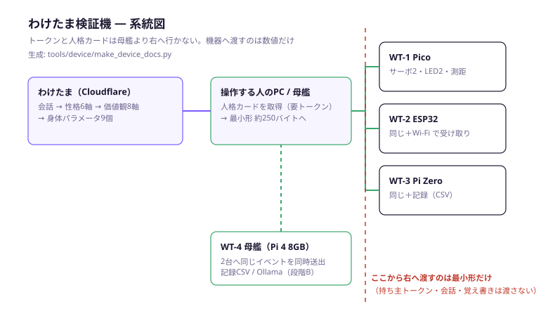

# わけたま検証機 — 設計書

Raspberry Pi 4 / Pi Zero 2 W / Pi Pico 2 W / ESP32
最終更新: 2026-09-20

図面: [device/](device/)（`tools/device/make_device_docs.py` が生成）

| ファイル | 中身 |
|---|---|
| `device/wt_system.svg` | 系統図。誰が何を持ち、どこから先へ何を渡さないか |
| `device/wt1_pico_wiring.svg` | WT-1（Pico）の配線図 |
| `device/wt2_esp32_wiring.svg` | WT-2（ESP32）の配線図 |
| `device/wt3_pi_wiring.svg` | WT-3（Pi）の配線図 |

関連: [DEVICE_SPEC.md](DEVICE_SPEC.md)（仕様）・[DEVICE_BUILD.md](DEVICE_BUILD.md)（作り方）・
[TEXT_TO_BEHAVIOR.md](TEXT_TO_BEHAVIOR.md)（会話→動きの理屈）・[EDGE_DEVICE_TEST.md](EDGE_DEVICE_TEST.md)（段階A/B/C）

---

## 0. この機械は何を証明するための道具か

わけたまは「会話から人格が育ち、その人格はクラウドの外でも通用する」と言っている。
言うのは簡単で、**反証もされにくい**。だから、反証できる形にするための機械を作る。

証明されたと言える条件を、先に3つ決めておく。

| # | 満たすこと | 満たさないときの意味 |
|---|---|---|
| 1 | **同じ配線・同じファームのまま、人格を差し替えると動きが変わる** | 差が機器側の作り込みから来ている。人格データは飾り |
| 2 | **性格が逆の2体に、同じ瞬間に同じイベントを投げると、違う動きが出る** | 差が順番や偶然から来ている |
| 3 | **ネットを切っても 1 と 2 が続く** | クラウドに繋がっているだけ。持ち出せていない |

1台だけ動かしても、どれも示せない。**2台同時**が要る。この設計書の中心はそこにある。

数値の差が出ているかは人の目で判断しない。`tools/device/common/wt_core.py` の `compare()` が
5項目で判定し、母艦の操作盤に合格／不合格で出る（基準は §5）。

---

## 1. 4つの構成

同じ振る舞いエンジンを載せた**同じ機械**を、載る石だけ変えて4通り作る。
別々の作品にしないのは、機種ごとに作り込むと「差が人格から来ている」と言えなくなるため。

| 型番 | 呼び名 | 石 | できること | 部品代の目安 |
|---|---|---|---|---|
| **WT-1** | たね | Raspberry Pi Pico 2 W | 段階A。単体で完結。いちばん小さい証明 | 約 3,000円 |
| **WT-2** | ふたば | ESP32-WROOM-32 | 段階A＋Wi-Fiで人格を受け取る／差し替えを見せる | 約 3,500円 |
| **WT-3** | こだち | Raspberry Pi Zero 2 W | 段階A＋記録（CSV）。Python のまま動かせる | 約 5,000円 |
| **WT-4** | もり | Pi 4 8GB ＋ 上記2台 | **2体同時比較・記録・段階B（ローカルLLMで喋る）** | 約 22,000円 |

**買うなら WT-4 の一式。** WT-1〜3 はその部分集合で、単体でも成立するように作ってある。
最初の1台だけ作るなら WT-1（Pico）。いちばん安く、いちばん強い主張（520KB で人格が動く）が取れる。

### 1-1. なぜ Pi Zero / Pico / ESP32 に LLM を載せないか

載せない。**載せられないからではなく、載せると証明が弱くなるから。**

小さい石に無理やり言語モデルを積むと、1文に数十秒かかる。見た人は「遅い」としか思わず、
人格の話が伝わらない。それ以前に、**言葉が出た時点で「AIだから当たり前」に見えて、
数値が身体を動かしていることが見えなくなる。**

この機械が見せたいのは、**言葉を一度も使わずに、性格の違いが動きの違いになる**ところ。
言葉が要る場面は WT-4（Pi 4 ＋ Ollama）で別に見せる。

---

## 2. 系統 — どこで何が止まるか



```
わけたま（Cloudflare）
   │  /api/character/card  … 会話の抜粋・覚え書き・属性を含む数十KB。要トークン
   ▼
母艦（Pi 4）または操作する人のPC        ← ★ トークンと人格カードはここまで
   │  wt_compact.py … 数値と方針コードだけの 約250バイトへ。漏れを機械で検査
   ▼
子機（Pico / ESP32 / Pi Zero）          ← ★ ここから先は数値しかない
```

**この境界が設計のいちばん大事なところ。**
人格カードには持ち主の生活が書いてある。部屋に置く機械や、人に配る機械へ焼くものではない。
子機へ渡すのは「動きの質」を表す 9個の数値と、機械が分岐するための識別子だけ。

境界を守っていることは、目視ではなく検査で担保する:

- `wt_compact.audit()` が、会話・覚え書き・属性・systemPrompt の文字列が
  最小形に1つでも含まれていたら**配布を止める**
- `tools/device/selftest.py` §4 が、その検査が効いていることを毎回確かめる
- 子機のファームには、トークンを入れる場所そのものが無い

---

## 3. 機械の作り（共通）

4構成とも、**同じ体・同じ顔**にする。見た目が違うと、差が人格から来ているのか
作りから来ているのか分からなくなる。

| 部位 | 部品 | 何を表すか |
|---|---|---|
| 体 | SG90 サーボ 1個 | 待機の揺らぎ、姿勢の開き、前傾／後傾（＝近づく・下がるの代用） |
| 腕 | SG90 サーボ 1個 | 身振り（手を振る回数） |
| 口 | LED（橙）1個 | `baselineSmile`。笑顔の基準 |
| 目 | LED（白）1個 | `gazeHoldMs`。目線を保っているあいだ点く |
| 耳 | タクトスイッチ | 「話しかけられた」 |
| 距離 | HC-SR04 | 「人が近づいた」。`comfortableDistanceM` と比べる |
| 声 | 受動ブザー（任意） | 無くても検証は成立する |

**車輪は付けない。** 付けると場所と安全の話が増えて、検証が進まなくなる。
`drive forward` は前傾で代用し、**代用したことを動作ログに残す**
（`wt_actuate.py` の `substitutions`）。ごまかすより、代用したと書く方が強い。

### 3-1. 9個の数値の割り当て

[TEXT_TO_BEHAVIOR.md §4-1](TEXT_TO_BEHAVIOR.md) の9個を、この機械の可動域いっぱいに写す。

| 数値 | この機械での出方 | 範囲 |
|---|---|---|
| `energy` | 待機の周期 | 4000 − energy×20 ms（2000〜4000ms） |
| `gestureRate` | 手を振る回数 | `gestureRate / 25` 回（0〜4回） |
| `idleVariance` | 待機の揺れ幅 | ±0〜12度 |
| `responseDelayMs` | 話しかけてから動くまで | そのまま ms |
| `gazeHoldMs` | 目のLEDが点いている長さ | そのまま ms |
| `postureOpenness` | 体サーボの中心角 | 90 − (50−posture)/4 度 |
| `comfortableDistanceM` | 寄るか下がるかの境目 | そのまま m |
| `approachSpeedMps` | 前傾の深さ | 固定18度（車輪が無いため。**ここは弱い**） |
| `baselineSmile` | 口のLEDの明るさ | そのまま % |
| `blinkRatePerMin` | 待機1周の長さ | 60000 / blink ms |

`approachSpeedMps` だけ、この機械では差が出にくい。**弱いところは弱いと書く。**
速さの差まで見せたいなら、車輪か、もっと可動域の広い腕が要る。

---

## 4. 部品表（WT-4 一式・2026年9月の目安）

価格は変わる。**発注前に必ず確認すること。**

| 品 | 型番の例 | 数 | 単価目安 | 小計 |
|---|---|---|---|---|
| Raspberry Pi 4 8GB | — | 1 | 13,000 | 13,000 |
| Raspberry Pi Pico 2 W | ピンヘッダ実装済み | 1 | 1,300 | 1,300 |
| ESP32 開発ボード | ESP32-DevKitC-32E | 1 | 1,600 | 1,600 |
| サーボ | SG90 | 4 | 500 | 2,000 |
| 超音波測距 | HC-SR04 | 2 | 300 | 600 |
| LED 白・橙 | 3mm | 4 | 20 | 80 |
| 抵抗 330Ω | 1/4W | 4 | 10 | 40 |
| 抵抗 10kΩ / 20kΩ | 分圧用 | 各2 | 10 | 40 |
| タクトスイッチ | — | 2 | 20 | 40 |
| 電解コンデンサ 470µF | 10V以上 | 2 | 30 | 60 |
| ブレッドボード | 半サイズ | 2 | 300 | 600 |
| ジャンパ線 | オス-オス／オス-メス | 1組 | 700 | 700 |
| ACアダプタ 5V 2A | DCジャック付き | 1 | 1,000 | 1,000 |
| DCジャック→端子台 | — | 1 | 150 | 150 |
| microSD 32GB | Class10 | 1 | 1,000 | 1,000 |
| Pi 4 用 電源・放熱 | 公式アダプタ＋ヒートシンク | 1 | 2,500 | 2,500 |
| USBケーブル | microB / Type-C | 2 | 500 | 1,000 |
| | | | **合計** | **約 25,700円** |

WT-1 だけなら: Pico 2 W ＋ サーボ2 ＋ LED2 ＋ 抵抗 ＋ スイッチ ＋ HC-SR04 ＋
ブレッドボード ＋ ジャンパ ＋ ACアダプタ ＝ **約 4,500円**。

### 4-1. 電源だけは削らないこと

**サーボの電源を基板から取らない。** これが、この手の工作で最も多い失敗で、
症状は「動き出した瞬間に再起動する」「書き込み直後だけ動く」。
別の 5V 2A から取り、GND だけ基板と繋ぐ。電源ラインに 470µF を1本入れる。

ESP32 は Wi-Fi 送信の瞬間に 300mA 近く食うので、なおさら共有しない。

---

## 5. 合格の基準

`wt_core.compare()` が判定する5項目。母艦の操作盤と `wt_hub.py compare` に出る。

| 項目 | 基準 | なぜこの線か |
|---|---|---|
| 返すまでの間 | **1.5倍以上ちがう** | 実測の2体は1.9〜2.3倍に散らばる。2.0倍は1回の実測をそのまま線にしていて、きつすぎた |
| 身振りの回数 | **ちがう** | `gestureRate/25` が同じだと、見た目で差が分からない |
| 近づく判断 | **分かれる** | 片方が寄って片方が待つ。撮ったときに一番伝わる |
| 方針コード | **互いに片方だけのものがある** | 重なっているだけなら、性格が近すぎる |
| 手順 | **半分以上のイベントで違う** | 1イベントだけの差は偶然でも起きる |

**満たさないときは、機械ではなく分身を疑うこと。** 会話35回（おしゃべり期）未満の
分身どうしを比べても差は出にくい（[TEXT_TO_BEHAVIOR.md §8](TEXT_TO_BEHAVIOR.md)）。

---

## 6. 実機に触る前に通すもの

```bash
npm run device:selftest
```

7項目を機械で確かめる。**ここが赤いまま現場へ持って行かないこと。**

| # | 確かめること | 落ちたときに起きること |
|---|---|---|
| 1 | contract.json と実装の並びが一致 | 機器が別の数値を別の意味で読む |
| 2 | `wt_core.py` と `rule_runtime.py` が同じ答え | PCでの確認と実機がずれる |
| 3 | `wt_core.py` と `wt_core.h`（C++）が同じ答え | **ESP32だけ性格が違う** |
| 4 | `wt_compact.py` と `compact.mjs` が1バイトまで一致 | 母艦とPCで違う人格が出る |
| 5 | 見本の2体が合格基準を満たす | 判定そのものが壊れている |
| 6 | ピンの重複・ESP32の禁止ピン | 書き込めない／石が死ぬ |
| 7 | 配線図とピン定数が pinmap.json と一致 | 図を見て配線した人だけ動かない |

3 は g++ でホストにビルドして1行ずつ突き合わせている。
**同じ規則を2つの言語で書く以上、人の目で見比べるのは諦める。**

---

## 7. この設計の限界（先に書く）

- **車輪が無い。** 距離と速さの差は前傾で代用している。`approachSpeedMps` の検証は弱い
- **表情がLED2個。** 口角と視線しか出せない。`blinkRatePerMin` は待機周期に混ぜてある
- **音を測っていない。** 「話しかけられた」はボタン。声の大きさや抑揚は入力にしていない
- **1台あたりの姿勢が1軸。** 首と体を分けていないので、`head` の指示も体サーボで出す
- **段階Bは Pi 4 でも遅い。** 3B量子化で 2〜4 tok/s。1文に十数秒かかる前提で見せること

どれも「今は見せられない」であって、「原理的に無理」ではない。
相手に伝えるときは、この区別を落とさないこと。

---

## 8. ファイルの場所

| 目的 | 場所 |
|---|---|
| 並びの取り決め（唯一の出所） | `tools/device/contract.json` |
| ピン割り当て（唯一の出所） | `tools/device/pinmap.json` |
| 振る舞いエンジン（Python） | `tools/device/common/wt_core.py` |
| 振る舞いエンジン（C++） | `tools/device/esp32/wt_device/wt_core.h` |
| 指示→角度・明るさの割り当て | `tools/device/common/wt_actuate.py` |
| 通信の取り決め | `tools/device/common/wt_proto.py` |
| 人格カード→最小形（Python） | `tools/device/common/wt_compact.py` |
| WT-1 ファーム | `tools/device/pico/main.py` |
| WT-2 ファーム | `tools/device/esp32/wt_device/wt_device.ino` |
| WT-3 ノード | `tools/device/pi/wt_node.py` |
| WT-4 母艦・操作盤 | `tools/device/pi/wt_hub.py` / `console.html` |
| 自己点検 | `tools/device/selftest.py`（`npm run device:selftest`） |
| 図面とピン定数の生成 | `tools/device/make_device_docs.py`（`npm run device:docs`） |
| 見本の人格2体 | `tools/device/samples/` |
